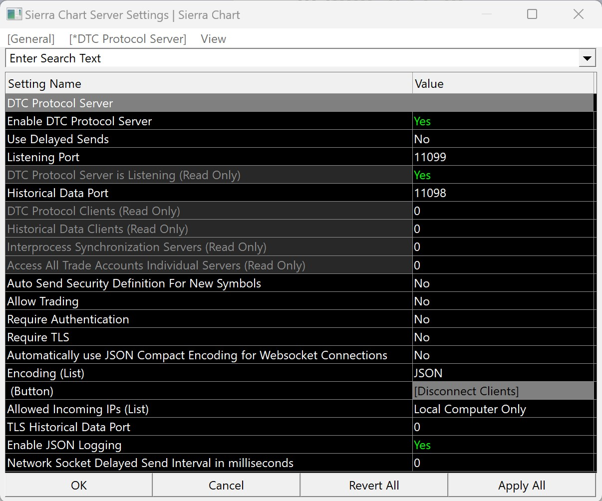
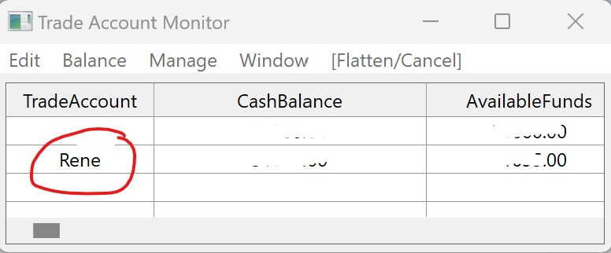

# Sierrachart2Tradervue

## Description
This program imports fills for a given Sierrachart trade account into Tradervue.

## How it works
It connects to the [DTC server](https://www.sierrachart.com/index.php?page=doc/DTCServer.php) on your local instance of Sierrachart and request 
fills for a given trade account for the given number of days back. 
Once received, it converts them to Tradervue executions and imports them into 
Tradervue using the [Tradervue REST API](https://github.com/tradervue/api-docs).

## Requirements - Sierrachart
Your local instance of Sierrachart must be running and have the 
DTC server enabled with the following options:

`Global Settings -> Sierrachart Server Settings`

* Enable DTC Protocol Server: Yes
* Use Delayed Sends: No
* Listen Port: 11099
* Require Authentication: No
* Require TLS: No
* Encoding: JSON

Furthermore, you need to know the Sierrachart trade account name. This can be a simulated or real account.

## Requirements - Tradervue
You must have a Tradervue account and know your username and password.

## Usage
Required flags:
* `-tv_username <TV Username>`
* `-tv_password <TV Password>` 
* `-sc_account <SC Trade Account or sim name>` 
* `-sc_days <Number of days back to request fills for>` 

Optional flags:
* `-tv_tags <comma seperated list of tags to use for TV import>`
* `-tv_account_tag <Tradervue account tag>`

### Example
`Sierrachart2Tradervue.exe -tv_username exampleuser -tv_password examplepassword -sc_account Sim1 -sc_days 3 -tv_tags tag1,tag2,tag3 -tv_account_tag SC-Sim1
`

